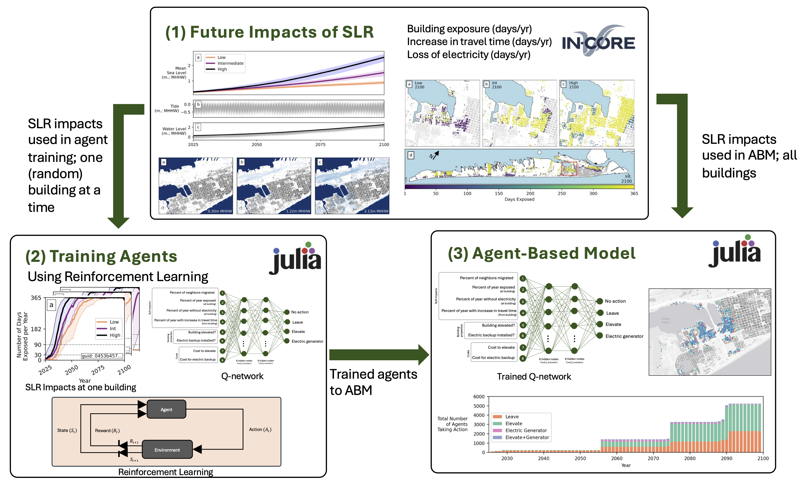

My research focuses on assessing the impacts of natural and climatic hazards on the built and social environments at regional scales. I am particularly interested in both the development of geospatial decision-support tools and using existing models in novel ways. 

This page summarizes my research and development projects completed throughout my career. Click on a header below to learn more each project. 

<!-- ============================ -->

 <b> Hurricane Overland Hazards and the Built Environment </b> 

<i> More Coming Soon <i>

 
<!-- ============================ -->

<!-- ============================ -->

 <b>Evaluating Future Impacts of Sea Level Rise on Coastal Communities </b> 

<i> Summary: </i>  
I completed this work during my time as a National Research Council Postdoctoral Fellow at NIST. The objective of this work was to develop decision-support tools to help communities become more resilient to chronic hazards that are associated with a changing climate. In particular, I focused on flooding due to sea level rise (SLR) and high tides, and considered the resulting impacts on buildings, electric power, and transportation networks. On top of this, I developed an agent-based model to simulate how households may respond to the future impacts of SLR. Reinforcement learning was used to characterize agent behavior. This allows agents to learn for themselves how to respond to changes in their envirnment.   

<i> Figures from this work: </i>  
 
<figcaption>Building exposure in 2100 quantified as number of days per year exposed. Three different sea level rise scenarios (low, intermediate, and high) are shown.</figcaption> 

 
<figcaption>Framework for developing an agent-based model of household adaptation to the future impacts of SLR. Reinforcement learning is used to characterize agent behavior.</figcaption> 

 

<i>Research products originating from this project</i>:  
Two manuscripts (<a href="https://doi.org/10.1016/j.ijdrr.2025.105649">1</a>, <a href="https://doi.org/10.1016/j.ijdrr.2025.105742">2</a>), one Jupyter notebook (<a href="https://doi.org/10.5281/zenodo.11402964">1</a>), and one geospatial agent-based model (<a href="https://doi.org/10.5281/zenodo.15120768">1</a>).   

<i> Funding</i>:  
Two years of salary plus travel assistance through the <a href="https://www.nationalacademies.org/our-work/rap/nrc-research-associateship-programs" >National Research Council Postdoctoral Fellowship program.</a>   

<!-- ============================ -->

<!-- ============================ -->

 <b> NIST Community Resilience Center of Excellence </b> 

<i> More Coming Soon <i>

<!-- ============================ -->

<!-- ============================ -->

 <b> Interdisciplinary Alternative Futures Modeling for the Oregon Coast </b> 

<i> More Coming Soon <i>

<!-- ============================ -->

<!-- ============================ -->

 <b> Beach-fx and G2CRM Model Development </b> 

<i> More Coming Soon <i>

<!-- ============================ -->

