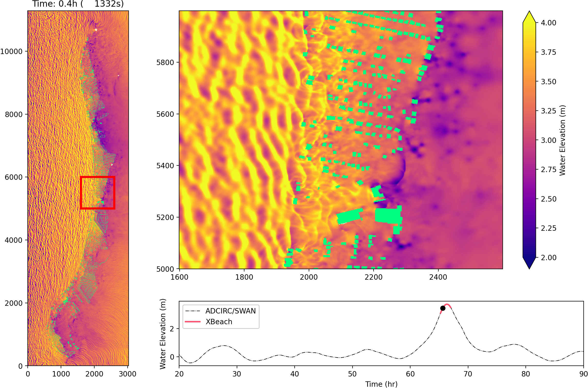
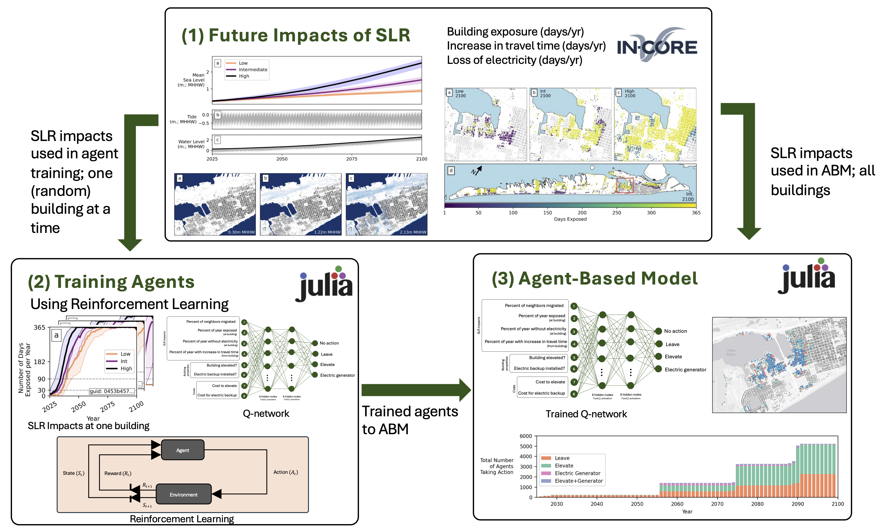
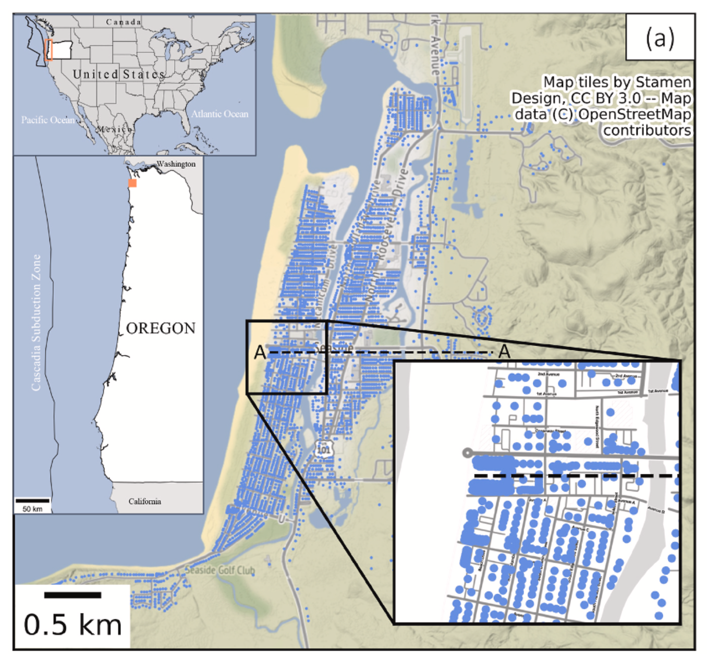
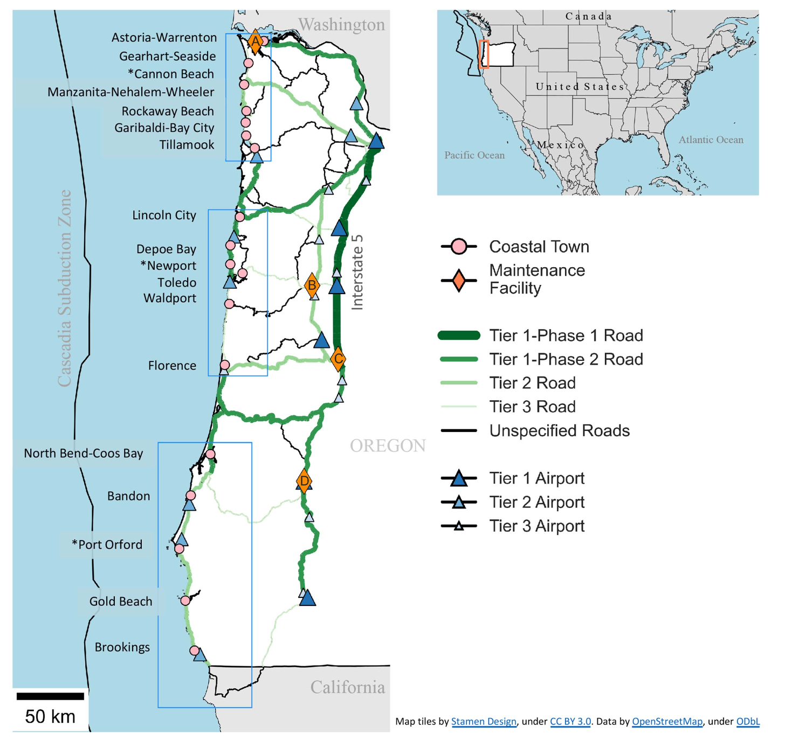
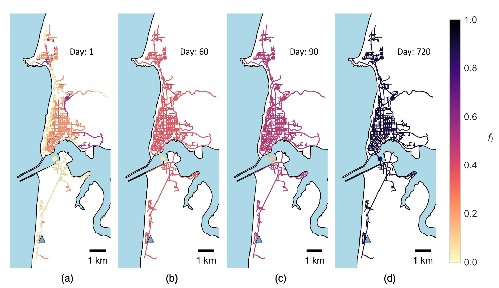

My work focuses on assessing the impacts of natural and climatic hazards on the built and social environments at regional scales. I am particularly interested in both the development of geospatial decision-support tools and using existing models in novel ways. 

This page summarizes the work I've completed throughout my career. Click on a header below to learn more about each project. 

<!-- ============================ -->

 <b> Hurricane Overland Hazards and the Built Environment </b> 

<i> Summary: </i>  
This is on-going work looking at modeling hurricane overland surge, waves, and currents through the built environment. Coastal models of hurricane storm surge typically neglect the built environment, or represent it through changes in bottom friction coefficients despite the importance of buildings in influencing overland waves and currents. For risk and catastrophe modlels, this can lead to inaccurate estimates of hurricane damage, translating to inaccurate estimates of economic losses. Preliminary results show that including buildings in numerical models of overland hazards significantly influence wave heights at individual structures. As expected, buildings near to the shoreline act to shelter subsequent rows of buildings. Interestingly, however, including buildings in the simulations also results in some buildings observing larger wave heights compared to scenarios in which no buildings are included in the model domain.    

<i> Figures from this work: </i>  
 
<figcaption>Snapshot from an XBeach simulation with buildings (green polygons) included in the model domain. </figcaption> 

<i>Products originating from this work</i>:  
Currently in progress.  

<i> Funding</i>:  
Funding from NIST provided as a part of the <a href="https://www.nist.gov/disaster-failure-studies/hurricane-ian">Hurricane Ian Study.</a>   

<!-- ============================ -->

<!-- ============================ -->

 <b>Evaluating Future Impacts of Sea Level Rise on Coastal Communities </b> 

<i> Summary: </i>  
I completed this work during my time as a National Research Council Postdoctoral Fellow at NIST (2023-2025). The objective of this work was to develop decision-support tools to help communities become more resilient to chronic hazards that are associated with a changing climate. In particular, I focused on flooding due to sea level rise (SLR) and high tides, and considered the resulting impacts on buildings, electric power, and transportation networks. On top of this, I developed an agent-based model to simulate how households may respond to the future impacts of SLR. Reinforcement learning was used to characterize agent behavior. This allows agents to learn for themselves how to respond to changes in their envirnment.   

<i> Figures from this work: </i>  
 
<figcaption>Building exposure in 2100 quantified as number of days per year exposed. Three different sea level rise scenarios (low, intermediate, and high) are shown.</figcaption> 

 
<figcaption>Framework for developing an agent-based model of household adaptation to the future impacts of SLR. Reinforcement learning is used to characterize agent behavior.</figcaption> 

<i>Products originating from this work</i>:  
Two journal papers (<a href="https://doi.org/10.1016/j.ijdrr.2025.105649">1</a>, <a href="https://doi.org/10.1016/j.ijdrr.2025.105742">2</a>), one Jupyter notebook (<a href="https://doi.org/10.5281/zenodo.11402964">1</a>), and one geospatial agent-based model (<a href="https://doi.org/10.5281/zenodo.15120768">1</a>).   

<i> Funding</i>:  
Two years of salary plus travel assistance through the <a href="https://www.nationalacademies.org/our-work/rap/nrc-research-associateship-programs" >National Research Council Postdoctoral Fellowship program.</a>   

<!-- ============================ -->

<!-- ============================ -->

 <b> NIST Community Resilience Center of Excellence </b> 

<i> Summary: </i>  
I completed this work during my time as an MS and PhD student at Oregon State University (2018-2023). This project in particular was focused on contributing to the development of IN-CORE. My contributions focused on the multi-hazard (earthquake/tsunami) Seaside, Oregon testbed, where I: (1) assessed damages, economic losses, and network connectivity under various earthquake/tsunami return periods, (2) developed an agent-based model that considers how population growth, urban change, and urban planning measures impact community resilience, and (3) compared two building inventories for use in risk and resilience modeling.   

<i> Figure from this work: </i>  
 
<figcaption>Figure of the Seaside, OR testbed, where my work for this project was focused.</figcaption> 

<i>Products originating from this work</i>:  
Seven journal papers: four as first author (<a href="https://doi.org/10.1007/s11069-021-04900-9">1</a>, <a href="https://doi.org/10.1080/23789689.2021.1966164">2</a>, <a href="https://doi.org/10.1029/2022EF003059">3</a>, <a href="https://doi.org/10.1016/j.ijdrr.2023.103755">4</a>), three as a co-author (<a href="https://doi.org/10.1061/JITSE4.ISENG-2229">5</a>, <a href="https://doi.org/10.1007/s11069-023-05937-8">6</a>, <a href="https://doi.org/10.1016/j.ijdrr.2023.104125">7</a>), one dataset (<a href="https://doi.org/10.17603/ds2-sp99-xv89">1</a>), one agent-based model (<a href="https://doi.org/10.5281/zenodo.6870341">1</a>), four Jupyter notebooks and books (<a href="https://22dylan.github.io/UrbanChange-HazardConsequence/intro.html">1</a>, <a href="https://doi.org/10.5281/zenodo.6998352">2</a>, <a href="https://github.com/22dylan/pyincore_notebooks/tree/master/20200728_SBN">3</a>, <a href="https://github.com/22dylan/pyincore_notebooks/tree/master/20191219_Seaside_Dist">4</a>).   

<i> Funding</i>:  
Five years of support as a graduate research assistant. Partial support provided through the NIST Center of Excellence for Community Resilience Planning. One year was supported through an Oregon State University Civil and Construction Engineering Graduate Research Fellowship.   

<!-- ============================ -->

<!-- ============================ -->

 <b> Interdisciplinary Alternative Futures Modeling for the Oregon Coast </b> 

<i> Summary: </i>  
I completed this work during my time as an MS and PhD student at Oregon State University (2018-2023). This project in particular was focused on Interdisciplinary modeling of Oregon Coastal communities. For this project, I assessed the impact of the Cascadia Subduction Zone (CSZ) on buildings and the transportation network for the entire Oregon coast. These methods were integrated into an agent-based model, Envision, as a part of the Oregon Coastal Futures Project.   

My work assessing the impacts to the transportation network lead to a journal paper on considering the resilience of road and bridge transportation networks at both local- and regional-scales. The local scale refers to considering transportation damage, recovery, and increases in travel times within a community's boundaries (e.g., getting from home to work), whereas the regional scale refers to damage, recovery, and increases in travel times between communities (e.g., getting from community A to community B). The publication of this work lead to a press release from Oregon State University and participation in radio interviews by myself and co-authors.  

<i> Figures from this work: </i>  
 
<figcaption>Figure of the regional highway transportation network showing location of 18 coastal communities that were considered.</figcaption> 

 
<figcaption>Example of loss of functionality and recovery for one of the coastal communities (Newport, OR).</figcaption> 

<i>Products originating from this work</i>:  
Two journal papers: one first author (<a href="https://doi.org/10.1061/(ASCE)IS.1943-555X.0000694">1</a>), one as a co-author (<a href="https://doi.org/10.1080/23789689.2025.2525697">2</a>).   

<i> Funding</i>:  
Support provided through both Oregon Sea Grant and the Cascadia CoPes (Coastlines and People) Hub.   

<!-- ============================ -->

<!-- ============================ -->

 <b> Beach-fx and G2CRM Model Development </b> 

<i> Summary: </i>  
I completed this work during my time as a Research Civil Engineer at the US Army Corps of Engineers' (USACE) Research and Development Center (ERDC) (2016-2018). Beach-fx and G2CRM were originally developed to serve as two coastal flood risk models throughout USACE. These planning models consider tropical and extra-tropical cyclones, sea level rise, beach renourishment, sediment transport, and the economic losses assoicated with coastal hazards over the lifecycle of a project. My role at ERDC during my second year there was to be the principal investigator for Beach-fx and G2CRM. In this role I served as the primary point of contact for these models across USACE, identified future directions for model development, contributed to USACE projects using Beach-fx and G2CRM, and prepared technical notes and reports regarding model processes and suggested workflows.
  

<!-- ============================ -->

